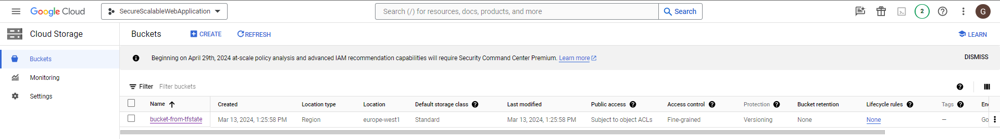

## Project Title
Deploying a Secure and Scalable Web Application

---

## Aim
Designing a scalable web application on GCP (Google Cloud Platform),
deploy and secure; basic cloud engineering concepts and aims to show your skills in its services. The project, solutions in architecture, GCP use services effectively and implement security best practices it aims to evaluate your skills.

---

## Project Requirements
Code as Infrastructure (IaC) - TERRAFORM
Define and deploy your infrastructure using Terraform:

> API 
* Compute Engine API
* Service Networking API
* Cloud SQL Admin API
* Cloud Monitoring API
* Cloud Resource Manager API
* Cloud DNS API

> 1. Create a VPC network.

> 2. Create a subnet in the VPC you created. ( Region : europe-west1)

> 3. Create a Cloud Router in the network you created and create a NAT Gateway.

> 4. Create an Instance template in the subnet you created.
* Instance type : e2-micro
* Boot disk: debian-11
* Startup-script: Apache2 or nginx web server installation and a simple welcome
* Add the startup script that creates the index.html file containing the text.

> 5. Create a Managed Instance Group using the template you created.
The configuration that the Managed Instance Group to be created must have settings:
* It should not be a public IP address.
* Must access the internet via NAT Gateway.
* Instance zone : europe-west1-d

> 6. Create Autoscaler.
* Target CPU utilization: 50%

> 7. Create a load balancer in front of the instances you created.

---

## Security
Create a service account for Terraform and use Terraform with this service account.
Connect it to the project. Service account privileges based on least privilege do it with privilege policy.

---

## Monitoring and Logging
Create alarms based on CPU usage for the instances you create.
 
#### Create group of VMs

- Go to Monitoring&rarr;Groups
- Click on Create Group
- Name: app-server-group
- Criteria:
  - Type: Resource TYpe
  - Resource Type: VM Instance

#### Create Uptime Check

- Go to Monitoring&rarr;Uptime Checks
- Click on Create Uptime Check
- Target:
  - Protocol: HTTP
  - Resource Type: Instance
  - Applies to: Group
    - app-server-group
  - Path: /
  - Port: 8080
  - Title: app-instance-level-uptime-check

---

## Creating Database
    Create a CloudSQL instance with a private IP. (PostgreSQL)
    Connect via SSH to one of the VMs you created.
    Set up Cloud SQL Auth Proxy on the VM.
    Connect to the Cloud SQL instance with Private IP.

---

##### Use SSH VMs for this step.

> sudo apt-get update
  sudo apt-get install postgresql-client 
  
> sudo apt-get install wget
    
> wget https://storage.googleapis.com/cloud-sql-connectors/cloud-sql-proxy/v2.8.2/cloud-sql-proxy.linux.amd64 \
    -O cloud-sql-proxy

> chmod +x cloud-sql-proxy

>./cloud-sql-proxy --private-ip securescalablewebapplication:europe-west1:cloudsql-instance

> psql "host=127.0.0.1 port=5432 sslmode=disable dbname=cloudsql-instance user=postgres"

---

## Cloud storage
In this section, you should use Google Cloud Storage as remote backend.
is requested.
The bucket you will create should not be public and should have object versioning feature.
should be.
The Terraform state file you created should be kept in this bucket.

---

## Presentation Guide(Optional):
Create a GitHub repository to host your project code and documentation.
Describing your project architecture, deployment steps, and any additional considerations
Add a detailed README.md.

---

### Documentation

- [Terraform Documet](https://registry.terraform.io/providers/hashicorp/google/latest/docs)

- [Connect using the Cloud SQL Auth proxy](https://cloud.google.com/sql/docs/postgres/connect-instance-private-ip)

- [CLoud SQL Auth proxy](https://cloud.google.com/sql/docs/mysql/connect-auth-proxy)

You have production and test workloads that you want to deploy on Compute Engine. Production VMs need to be in a different subnet than the test VMs. All the
VMs must be able to reach each other over Internal IP without creating additional routes. You need to set up VPC and the 2 subnets. Which configuration meets these requirements?
Nurşah Mican
10:53
A. Create a single custom VPC with 2 subnets. Create each subnet in a different region and with a different CIDR range.
B. Create a single custom VPC with 2 subnets. Create each subnet in the same region and with the same CIDR range.
C. Create 2 custom VPCs, each with a single subnet. Create each subnet in a different region and with a different CIDR range.
D. Create 2 custom VPCs, each with a single subnet. Create each subnet in the same region and with the same CIDR range